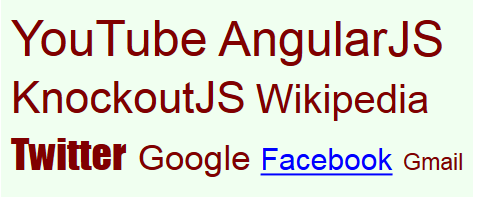
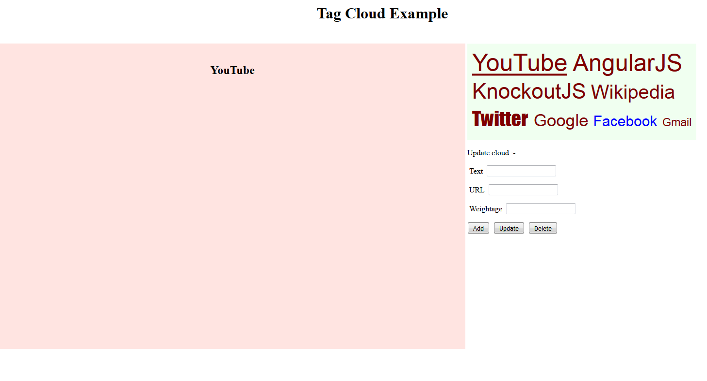

# ko-tagCloud
A tag cloud creator using SVG and KnockoutJS.

<h1>Features</h1>
<ul>
<li>The example uses KnockoutJS custom bindings. But the tagCloud.js can be used without KnockoutJS too.</li>
<li>Dependent on Scalable Vector Graphics.</li>
<li>Lightweight - 7kb.</li>
<li>Simple, well documented and easy to use.</li>
</ul>

<h1>Usage</h1>

<pre>
<head>
  <!--&nbsp;KnockoutJS is required only if ko_click option is used&nbsp;-->
  <script type="text/javascript" src="./knockout-3.4.0.js"/>
  <script type="text/javascript" src="./tagCloud.js"/>
</head>
</pre>

<h1>API</h1><pre>
Calling the TagCloud function with parameters will generate a tag cloud and append it to the 
element with given id. The parameters are :-
<b>id</b> - HTML element id.
<b>data</b> - javascript array of JSON objects with data for tag cloud elements.
<b>parameters</b> - JSON object with tag cloud level settings.
<b>TagCloud(element.id, data, parameters);</b>
</pre>

<h2>parameters argument</h2>

 This is an optional argument. If skipped, all values will be set to defaults.

<table width="100%">
<thead>
<tr>
<th>Option</th>
<th>Value</th>
<th>Default</th>
<th>Description</th>
</tr>
</thead>
<tr>
<td>width</td>
<td>Any value allowed for SVG container</td>
<td>500</td>
<td>The given value for width or default value of 500 is treated as maximum width of the tag cloud. After the elements are created the space is optimized. If the elements seem to overflow then the value and/or the element weightage can be adjusted.</td>
</tr>
<tr>
<td>height</td>
<td>Any value allowed for SVG container.</td>
<td>500</td>
<td>The given value for height or default value of 500 is treated as maximum height of the tag cloud. After the elements are created the space is optimized. If the elements seem to overflow then the value and/or the element weightage can be adjusted.</td>
</tr>
<tr>
<td>bgColor</td>
<td>Value in format #ffffff or rgb(255,255,255).</td>
<td>rgb(255,255,255)</td>
<td>This option sets the background color of the tag cloud.</td>
</tr>
<tr>
<td>fill</td>
<td>Value in format #ffffff or rgb(255,255,255).</td>
<td>rgb(0,0,0)</td>
<td>This option sets the text color of all the tag elements in the cloud. It can be also set on specific cloud element.</td>
</tr>
<tr>
<td>font-family</td>
<td>Name of font family like Arial, Calibri etc.</td>
<td>Helvetica Neue,Helvetica,Arial,sans-serif,Impact</td>
<td>This option sets the font family of all the text elements. It can be also set on specific cloud element.</td>
</tr>
<tr>
<td>weightage</td>
<td>Value between 1 - 5. Decimal numbers are also allowed. </td>
<td>30</td>
<td>This option sets the font size of all the text elements. It can be also set on specific cloud element. It is recommended to set this option on specific element so that they are displayed as per their prominence.</td>
</tr>
<tr>
<td>font-weight</td>
<td>Values allowed for font-weight of SVG text element.</td>
<td>400</td>
<td>This option sets the font weight of all the text elements. This will set the value for boldness of the text. It can be also set on specific cloud element.</td>
</tr>
<tr>
<td>font-style</td>
<td>Values allowed for font-style of SVG text element.</td>
<td>normal</td>
<td>This option sets the font style of all the text elements. It can be also set on specific cloud element.</td>
</tr>
<tr>
<td>font-stretch</td>
<td>Values allowed for font-stretch of SVG text element.</td>
<td>normal</td>
<td>This option sets the font stretch of all the text elements. It can be also set on specific cloud element.</td>
</tr>
</table>

<h2>data argument</h2>

 This is a required argument. The data argument should be a javascript array with JSON objects with following options :-

<table>
<thead>
<tr>
<th>Option</th>
<th>Value</th>
<th>Description</th>
</tr>
</thead>
<tr>
<td>url</td>
<td>href of a link. Eg. http://www.github.com</td>
<td>With the value of url an anchor element will be created around
the given text of the could element. On clicking the element, the
page will navigate to the given url.</td>
</tr>
<tr>
<td>target</td>
<td>Target of the anchor element. Eg. _blank, _self, _parent etc. Default value is _top.
<td>The url will be loaded as per the target value. This option
 is only used when url option is set.</td>
</tr>
<tr>
<td>onclick</td>
<td>Name of the function to be called, on clicking the 
tag cloud element.
<td>This option is to be used when url option is not set.
Instead of loading a page, the click action will be sent
to a function.
Eg.
<pre>
function setContentOfPage(){
//Code to set content of page based on 
//clicked tag cloud element.
}
//cloud element JSON inside array should be
cloudElement = {......."textContent":"GitHub" , 
  "onclick" : "setContentOfPage"........};

//the text element in tag cloud will be created as -
<text ..... onclick="setContentOfPage('GitHub',this);"
......>
  GitHub </text>
</pre>
As given above, the function with given name will be 
called by passing the textContent of that element 
and also the text element itself so that other 
properties of it can be read.
</td>
</tr>
<tr>
<td><b>ko_onclick</b></td>
<td>Name of the knockout function to be called,
on clicking the tag cloud element.</td>
<td>This option is to be used when url option is 
not set. Instead of loading a page, the click action
will be sent to a knockout function.
Eg.
<pre>
function tagCloudViewModel (){
var self = this;
........
self.setContentOfPage = function(){
  //Code to set content of page based 
  //on clicked tag cloud element.
  }
.......
}
ko.applyBindings(new tagCloudViewModel());

//cloud element inside data array should be
cloudElement = {
......."textContent":"GitHub" , 
  <b>"ko_onclick"</b> : "setContentOfPage"
  ........};

//the text element in tag cloud will be 
//created as -
<text ..... data-bind="click : setContentOfPage"
......>
  GitHub </text>
</pre>
As given above, a knockout click binding will be 
created with the given function name. Knockout will 
call the function with data and event arguments from 
which the clicked element can be identified.
</td>
</tr>
</table>
<h2>Screenshot</h2>

Current style of the tag cloud is rectangular. The elements are sorted in descending order of their weightages.

<h2> Notes </h2>
<ul>
<li> As mentioned above, the tag cloud generator code optimizes the space. Example, let the bounds be given as width : 400 and height : 400. And the text elements are given with respective weightages. The code will create the tag elements with SVG texts. After creating, the code will check if there is extra space around the tag elements and then re-sizes the SVG container accordingly by adjusting the height and width attributes of SVG element. So the given bounds will be taken as maximum bounds.
If the user wants the tag cloud to be of fixed bounds on the page, then one can use a container element like <div> tag with the required bounds. And let the SVG tag cloud be created inside it.
<li>The weightages of elements based on which their size depends can be adjusted to match the requirement of the user. Optimum display for the elements on the page can be obtained by a little experimentation.</li>
<li>If the page is required to follow a responsive design, which means that on re-sizing the browser, the tag cloud should also be re-sized then the user can have it handled in a function which can detect resize events and then call the TagCloud function to recreate the elements. User can have the weightages to be dynamically scaled as per the changed bounds so that all elements fit inside the container and get displayed properly.</li>
</ul>
<h2>LICENSE</h2>
MIT License Copyright (c) 2016 SamratK
